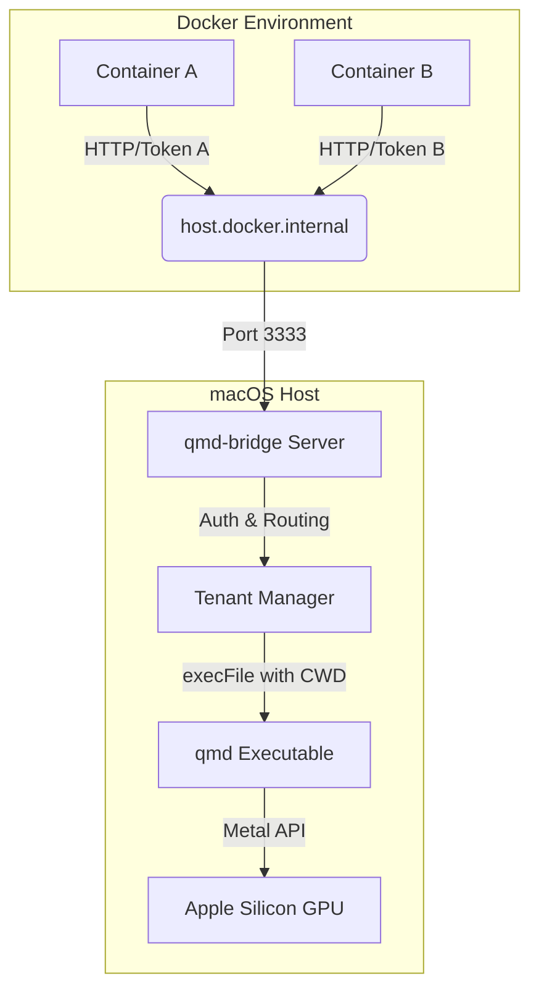

# qmd-bridge

A lightweight HTTP proxy service and CLI management tool that bridges Docker containers to the host `qmd` executable, enabling GPU-accelerated local knowledge base search on macOS.

## Problem

Docker Desktop for Mac cannot access host GPU/NPU resources due to virtualization limitations. Running `qmd` (Query Markup Documents) inside containers for vector search and LLM reranking is limited to CPU only — slow and resource-wasteful.

## Solution

**qmd-bridge** runs on the macOS host and acts as an HTTP proxy. It receives requests from Docker containers, executes `qmd` commands on the host (leveraging Apple Silicon Metal GPU acceleration), and returns results back to the containers.

### Key Benefits

- **GPU Acceleration** — Bypasses Docker limitations to use Apple Silicon directly
- **Multi-Tenant Isolation** — Single service instance serves multiple containers with token-based access control and path binding
- **Resource Efficiency** — LLM model loaded once system-wide, reducing RAM usage

## Prerequisites

- **Node.js** >= 18 LTS
- **qmd CLI** installed on the host (resolved via `$PATH` or configured explicitly)

## Installation

```bash
npm install -g qmd-bridge
```

## Quick Start

```bash
# Add a tenant (interactive)
qmd-bridge add

# Start the bridge server
qmd-bridge start

# Check status
qmd-bridge status
```

## Architecture



## CLI Commands

| Command | Description |
| --- | --- |
| `start` | Start the background daemon (`--port`, `--host`, `--max-concurrent`) |
| `stop` | Stop the service |
| `restart` | Restart the service |
| `status` | Show service status (PID, uptime, memory) |
| `list` | List all tenants |
| `add` | Interactively add a tenant |
| `rm <label>` | Remove a tenant |
| `edit <label>` | Interactively edit a tenant |
| `token show <label>` | Show tenant's token |
| `token rotate <label>` | Rotate tenant's token (old token is immediately invalidated) |
| `logs` | View logs (`-f` for follow mode) |
| `config` | View config file path |

## API

### `POST /qmd` — Execute a qmd query

```bash
curl -s -X POST http://host.docker.internal:3333/qmd \
  -H "Authorization: Bearer <token>" \
  -H "Content-Type: application/json" \
  -d '{"command": "search", "query": "how to configure authentication"}'
```

**Request Body**

| Field | Type | Required | Description |
| --- | --- | --- | --- |
| `command` | `string` | ✅ | Allowed: `search`, `vsearch`, `query` |
| `query` | `string` | ✅ | Query string (max 1000 chars) |

**Success Response (200)**

```json
{
  "success": true,
  "data": "<qmd stdout output>",
  "executionTime": 1234
}
```

**Error Codes**

| HTTP Status | Code | Description |
| --- | --- | --- |
| 400 | `INVALID_COMMAND` | Command not in allowed list |
| 400 | `QUERY_TOO_LONG` | Query exceeds max length |
| 400 | `INVALID_REQUEST` | Missing required fields |
| 401 | `INVALID_TOKEN` | Invalid or missing token |
| 500 | `EXECUTION_FAILED` | qmd execution failed |
| 503 | `TOO_MANY_REQUESTS` | Max concurrent limit reached |
| 504 | `EXECUTION_TIMEOUT` | qmd execution timed out |

### `GET /health` — Health check

```json
{
  "status": "ok",
  "version": "1.0.0",
  "uptime": 12345
}
```

## Docker Integration

Set these environment variables in your Docker container:

```bash
QMD_BRIDGE_URL=http://host.docker.internal:3333
QMD_BRIDGE_TOKEN=qmd_sk_...
```

## Configuration

Config is stored at `~/.config/qmd-bridge/config.json`.

| Key | Default | Description |
| --- | --- | --- |
| `server.port` | `3333` | Listen port |
| `server.host` | `127.0.0.1` | Bind address |
| `server.executionTimeout` | `30000` | qmd execution timeout (ms) |
| `server.maxConcurrent` | `0` | Max concurrent qmd processes (`0` = unlimited) |
| `qmdPath` | `""` | Path to qmd binary (empty = use `$PATH`) |

## Security

- **Command Injection Prevention** — Uses `execFile()` exclusively (never `exec()`)
- **Directory Isolation** — Each tenant is scoped to its configured absolute path via `cwd`
- **Input Validation** — Command whitelist + query length limit enforced via `zod`
- **Network Binding** — Defaults to `127.0.0.1` (localhost only)
- **Token Storage** — Config file permissions set to `600` (owner-only)

## License

MIT
