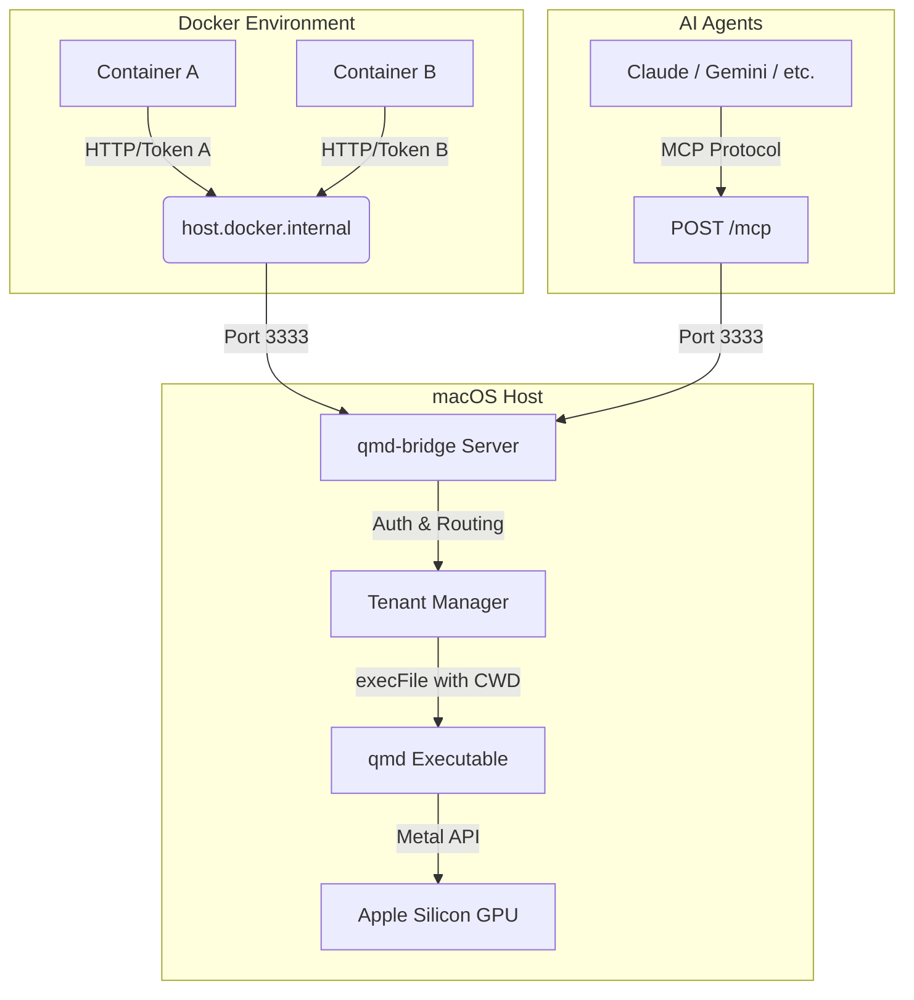

# qmd-bridge

[](https://www.npmjs.com/package/qmd-bridge)
[](https://www.npmjs.com/package/qmd-bridge)
[](https://github.com/s950329/qmd-bridge/blob/main/LICENSE)
[](https://nodejs.org)

A lightweight HTTP proxy service and CLI management tool that bridges Docker containers to the host `qmd` executable, enabling GPU-accelerated local knowledge base search on macOS. Also serves as an [MCP (Model Context Protocol)](https://modelcontextprotocol.io/) server, allowing AI agents to directly use qmd search capabilities.

## Problem

Docker Desktop for Mac cannot access host GPU/NPU resources due to virtualization limitations. Running `qmd` (Query Markup Documents) inside containers for vector search and LLM reranking is limited to CPU only — slow and resource-wasteful.

## Solution

**qmd-bridge** runs on the macOS host and acts as an HTTP proxy. It receives requests from Docker containers, executes `qmd` commands on the host (leveraging Apple Silicon Metal GPU acceleration), and returns results back to the containers.

### Key Benefits

- **GPU Acceleration** — Bypasses Docker limitations to use Apple Silicon directly
- **Multi-Tenant Isolation** — Single service instance serves multiple containers with token-based access control and path binding
- **Resource Efficiency** — LLM model loaded once system-wide, reducing RAM usage

## Benchmark

Tested on Apple M-series Mac with 10 queries × 1 run after warmup (models pre-loaded into OS page cache). Docker container runs on CPU only (no GPU access).

### Latency (mean ms per query)

| Environment | `search` (BM25) | `vsearch` (vector) | `query` (LLM pipeline) |
| --- | --- | --- | --- |
| Docker native (CPU) | 689 ms | 3,736 ms | **91,793 ms** ⚠ |
| Mac native (Metal GPU) | 879 ms | 2,298 ms | 1,121 ms |
| **Docker via qmd-bridge** | **751 ms** | **1,804 ms** | **963 ms** |

### Speedup vs Docker native

| Command | qmd-bridge vs Docker |
| --- | --- |
| `search` | ~1× (no difference — BM25 is CPU/SQLite, no GPU benefit) |
| `vsearch` | **2.1×** faster |
| `query` | **~95×** faster |

> **Notes:**
> - Docker native `query` averages 92 seconds because each `docker exec` spawns a new process that must reload ~2.1 GB of GGUF model files (query expansion + reranker) on CPU. Individual queries ranged from 1.8 s to 278 s depending on LLM output length.
> - qmd-bridge appears slightly faster than Mac native in `vsearch` and `query`. This is a measurement artifact: the benchmark runs scenarios in order (Docker → Mac → Bridge), so by the time Bridge executes, model files are already resident in the Mac OS page cache from prior Mac native runs. In practice, Bridge adds ~1–5 ms of HTTP overhead compared to Mac native — they are effectively equivalent in steady-state performance.

## Prerequisites

- **Node.js** >= 18 LTS
- **qmd CLI** installed on the host (resolved via `$PATH` or configured explicitly)

## Installation

**全域安裝（推薦）**

```bash
npm install -g qmd-bridge
```

**使用 npx 直接執行（免安裝）**

```bash
npx qmd-bridge start
```

**作為專案依賴安裝**

```bash
npm install qmd-bridge
```

## Quick Start

```bash
# Add a tenant (interactive)
qmd-bridge add

# Start the bridge server
qmd-bridge start

# Check status
qmd-bridge status
```

## Architecture



## CLI Commands

| Command | Description |
| --- | --- |
| `start` | Start the background daemon (`--port`, `--host`, `--max-concurrent`) |
| `stop` | Stop the service |
| `restart` | Restart the service |
| `status` | Show service status (PID, uptime, memory) |
| `list` | List all tenants |
| `add` | Interactively add a tenant |
| `rm <label>` | Remove a tenant |
| `edit <label>` | Interactively edit a tenant |
| `token show <label>` | Show tenant's token |
| `token rotate <label>` | Rotate tenant's token (old token is immediately invalidated) |
| `logs` | View logs (`-f` for follow mode) |
| `config` | View config file path |

## API

### `POST /qmd` — Execute a qmd query

```bash
curl -s -X POST http://host.docker.internal:3333/qmd \
  -H "Authorization: Bearer <token>" \
  -H "Content-Type: application/json" \
  -d '{"command": "search", "query": "how to configure authentication"}'
```

**Request Body**

| Field | Type | Required | Description |
| --- | --- | --- | --- |
| `command` | `string` | ✅ | Allowed: `search`, `vsearch`, `query` |
| `query` | `string` | ✅ | Query string (max 1000 chars) |

**Success Response (200)**

```json
{
  "success": true,
  "data": "<qmd stdout output>",
  "executionTime": 1234
}
```

**Error Codes**

| HTTP Status | Code | Description |
| --- | --- | --- |
| 400 | `INVALID_COMMAND` | Command not in allowed list |
| 400 | `QUERY_TOO_LONG` | Query exceeds max length |
| 400 | `INVALID_REQUEST` | Missing required fields |
| 401 | `INVALID_TOKEN` | Invalid or missing token |
| 500 | `EXECUTION_FAILED` | qmd execution failed |
| 503 | `TOO_MANY_REQUESTS` | Max concurrent limit reached |
| 504 | `EXECUTION_TIMEOUT` | qmd execution timed out |

### `GET /health` — Health check

```json
{
  "status": "ok",
  "version": "1.0.0",
  "uptime": 12345
}
```

### `POST /mcp` — MCP (Model Context Protocol) endpoint

Exposes qmd-bridge capabilities as MCP tools via [Streamable HTTP](https://modelcontextprotocol.io/specification/draft/basic/transports#streamable-http) transport. AI agents can discover and call tools through the standard MCP protocol.

**Available Tools**

| Tool | Auth | Description |
| --- | --- | --- |
| `qmd_search` | Token required | Keyword search against a qmd knowledge base |
| `qmd_vsearch` | Token required | Vector similarity search (embedding-based) |
| `qmd_query` | Token required | LLM reranking query for most relevant results |
| `qmd_list_tenants` | No | List all configured tenants (tokens excluded) |
| `qmd_health` | No | Server health check (version, uptime, active executions) |

Search tools require a `token` parameter (tenant Bearer token) and a `query` parameter.

**MCP Client Configuration**

```json
{
  "mcpServers": {
    "qmd-bridge": {
      "url": "http://localhost:3333/mcp"
    }
  }
}
```

## Docker Integration

Set these environment variables in your Docker container:

```bash
QMD_BRIDGE_URL=http://host.docker.internal:3333
QMD_BRIDGE_TOKEN=qmd_sk_...

# For MCP clients inside containers
QMD_BRIDGE_MCP_URL=http://host.docker.internal:3333/mcp
```

## Configuration

Config is stored at `~/.config/qmd-bridge/config.json`.

| Key | Default | Description |
| --- | --- | --- |
| `server.port` | `3333` | Listen port |
| `server.host` | `127.0.0.1` | Bind address |
| `server.executionTimeout` | `30000` | qmd execution timeout (ms) |
| `server.maxConcurrent` | `0` | Max concurrent qmd processes (`0` = unlimited) |
| `qmdPath` | `""` | Path to qmd binary (empty = use `$PATH`) |

## Security

- **Command Injection Prevention** — Uses `execFile()` exclusively (never `exec()`)
- **Directory Isolation** — Each tenant is scoped to its configured absolute path via `cwd`
- **Input Validation** — Command whitelist + query length limit enforced via `zod`
- **Network Binding** — Defaults to `127.0.0.1` (localhost only)
- **Token Storage** — Config file permissions set to `600` (owner-only)

## Disclaimer

> The core logic of this project was primarily written with the assistance of AI.
> Human oversight was applied for architecture decisions, code review, and quality assurance.

## Contributing

Contributions are welcome! Please read the [Contributing Guidelines](CONTRIBUTING.md) before submitting a pull request or opening an issue.

## License

MIT
